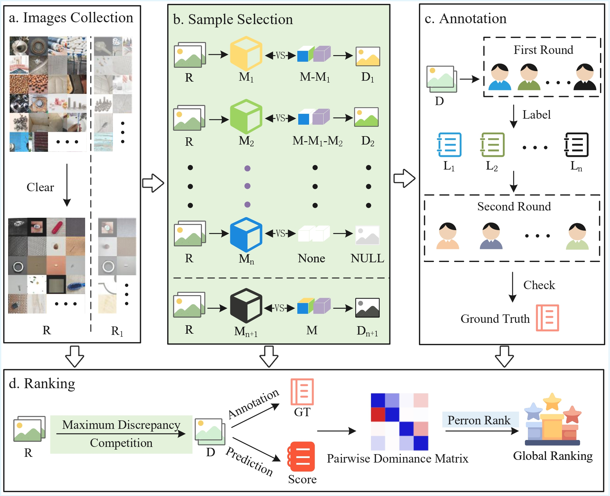
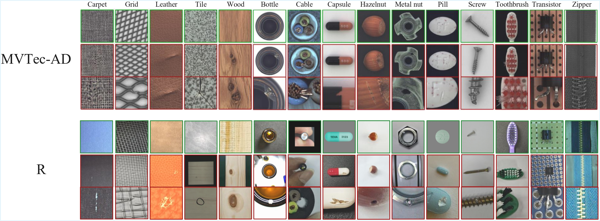
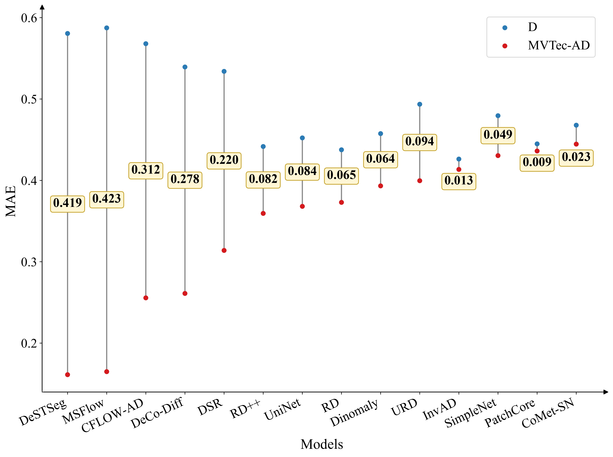
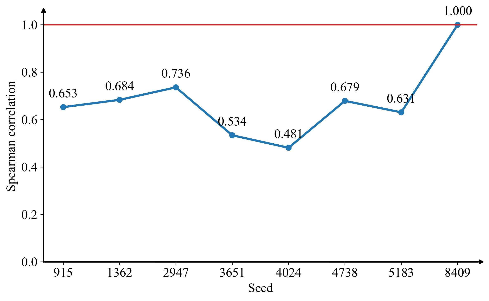
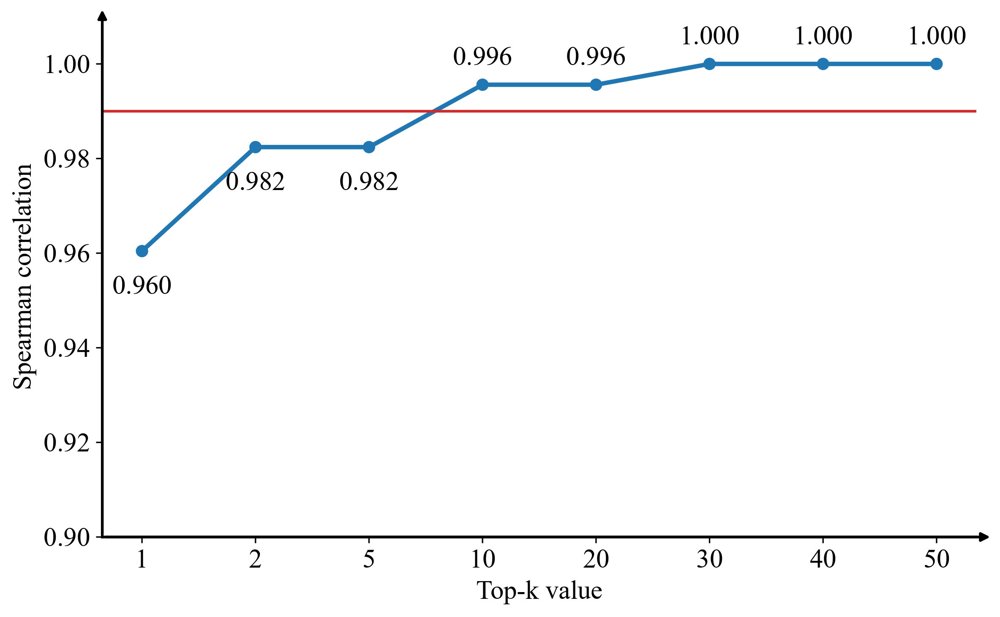

# Less-ls-More-Framework
  Evaluating the Consistency of Human Judgments Between State-of-the-Art Models on the MVTec AD Benchmark and Real-World Data.  
  
## 1. Stress Test Set Construction
   Construct a stress testing set **R** that the same categories as MVTec AD, with a larger scale and richer content diversity.  
   
## 2. Quantify Model Discrepancy
   2.1. Download and deploy the models in the Models folder to obtain prediction scores for each image.  
   2.2. Calculate pairwise model discrepancies on **R** using the Maximum Discrepancy Competition (MDC).  
   2.3. Select the top 10 samples with the largest differences from each category to form the stress test set $\mathcal{D}$, then compute the MAE between $\mathcal{D}$ and MVTec AD.  
         
## 3. Compute Global Ranking
   3.1. Obtain the pairwise result matrix **P**.  
   3.2. Calculate the pairwise performance matrix **F**.  
   3.3. Use the Perron rank method to compute the global ranking of the models.  
| Models    | MAE   | MAE Rank | Global Rank | $\Delta$ Rank |
|-----------|-------|----------|-------------|---------------|
| DeSTSeg   | 0.161 | 1        | 13          | -12           |
| MSFlow    | 0.165 | 2        | 14          | -12           |
| CFLOW-AD  | 0.256 | 3        | 12          | -9            |
| DeCo-Diff | 0.261 | 4        | 10          | -6            |
| DSR       | 0.314 | 5        | 11          | -6            |
| RD++      | 0.359 | 6        | 2           | +4            |
| UniNet    | 0.368 | 7        | 6           | +1            |
| RD        | 0.373 | 8        | 1           | +7            |
| Dinomaly  | 0.392 | 9        | 5           | +4            |
| URD       | 0.340 | 10       | 9           | +1            |
| InvAD     | 0.413 | 11       | 3           | +8            |
| SimpleNet | 0.430 | 12       | 8           | +4            |
| PatchCore | 0.436 | 13       | 4           | +9            |
| CoMet-SN  | 0.445 | 14       | 7           | +7            |
## 4. Verify Framework Stability
   Compare with random selection strategies and validate the stability of the framework using the Spearman correlation coefficient.(On the left are randomly selected 10 samples, and on the right are the top 10)
   <!-- 两张图片并排 -->

    
    

    
